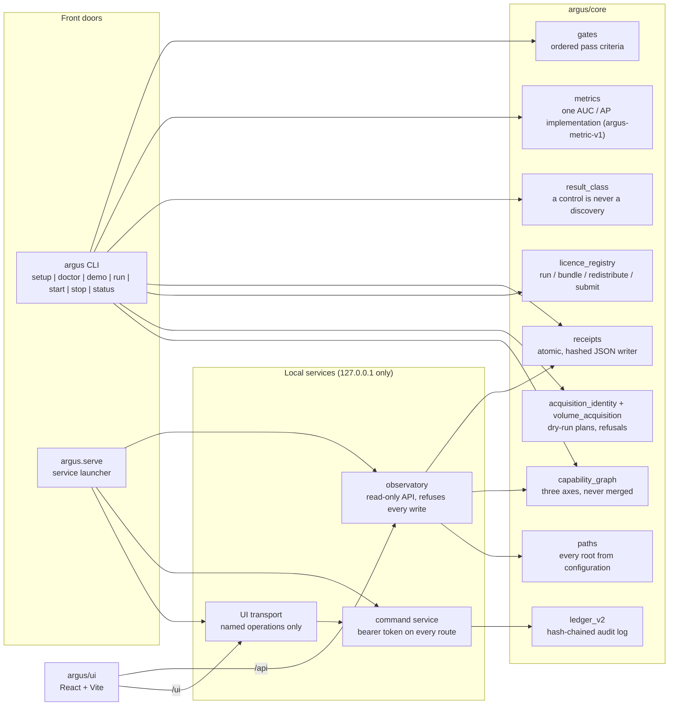

# Architecture

ARGUS has four parts: a command line, a core library, two local services, and a browser UI.
Everything runs on one machine and binds to loopback only, natively or as the Docker stack
(`Dockerfile`, `docker-compose.yml`; started by `Start-ARGUS.cmd` or `argus start`).

## Command line (`argus/cli`)

| Command | What it does |
|---|---|
| `argus demo` | Runs a synthetic fixture through a 3x3 box filter and the canonical metric. Offline, no GPU. The result class is `DEMONSTRATION_ONLY`, and the command raises an error if its own summary is edited into a claim. |
| `argus doctor` | Checks RAM, disk, CPU, Python dependencies, each external component, and the upstream pin. A check that cannot run is reported as `UNKNOWN`, not as a pass. |
| `argus setup` | Measures the machine, shows each component's licence, asks, fetches only what you accepted, and verifies every byte. It is safe to interrupt and re-run. |
| `argus start`, `argus stop`, `argus status` | Start, stop and inspect the Docker stack, with bounded waits and plain errors. `stop` never removes a named volume. |
| `argus run` | Runs the real pipeline on a named target. It refuses an ambiguous target, a machine that cannot finish the run, unverified inputs, and volumes the model's provenance policy does not cover. |

## Core (`argus/core`)

- **Three capability axes.** Availability (installed or not), operational verification (passed a
  control run or not) and scientific admissibility (whether an output may be presented as evidence)
  are stored and shown separately. A route can be available and verified and still inadmissible.
- **Result classes.** Every score carries its target class (labelled fragment, labelled scroll,
  unread scroll, synthetic), the target's exposure to training (held out by fold, trained on,
  unseen and proven, unknown) and a presentation label. `EXPOSURE_UNKNOWN` never counts as clean.
- **One metric.** `argus.core.metrics` is the only AUC and average-precision implementation. It
  refuses malformed input and records its `RULE_ID` alongside every result.
- **Receipts.** Results are written atomically as hashed JSON, so an output can be traced to the
  code and inputs that produced it.
- **Licences.** Each external component has four separate permissions: run locally, bundle,
  redistribute, and include in a prize submission. `UNDECLARED` counts as a refusal.
- **Paths.** Every data root comes from an environment variable with a neutral default under
  `ARGUS_HOME` (see `config/argus.example.env`). No machine-specific path is built in.

## Services (`argus/service`)

- **Observatory** (`python -m argus.serve observe`). A read-only HTTP and WebSocket API. Middleware
  refuses every write method, so nothing a browser does can change a run.
- **Command service** (`python -m argus.serve command`). A separate process on a separate port.
  Every route except `/health` needs a bearer token. The token is created on first start, stored
  outside the repository, and never returned by any endpoint. Each action resolves to a registered
  callable and is written to the hash-chained audit log. It accepts no command strings, script
  paths or module names.
- **UI transport** (`python -m argus.serve ui-transport`). Binds to loopback only. It holds the
  command credential on the server side and exposes a short list of named operations to the
  browser, not a general proxy.

## Interface (`argus/ui`)

Rooms: **Home** (the scroll shelf), **Explore** (holdings and scroll detail), **Workbench** (plane
viewer and layers), **Review** (decisions and qualification), **Evidence** (receipts and images
with their result class), **System** (capabilities, boundaries, credits), **Jobs** and **Sources**.
The **Grail Diary** panel shows context for the selected scroll and can be docked.

The public build always runs in **public demo mode**: surfaces that are not part of the public
release are removed from the page, not just hidden with CSS, and a short note says so where they
would appear.
