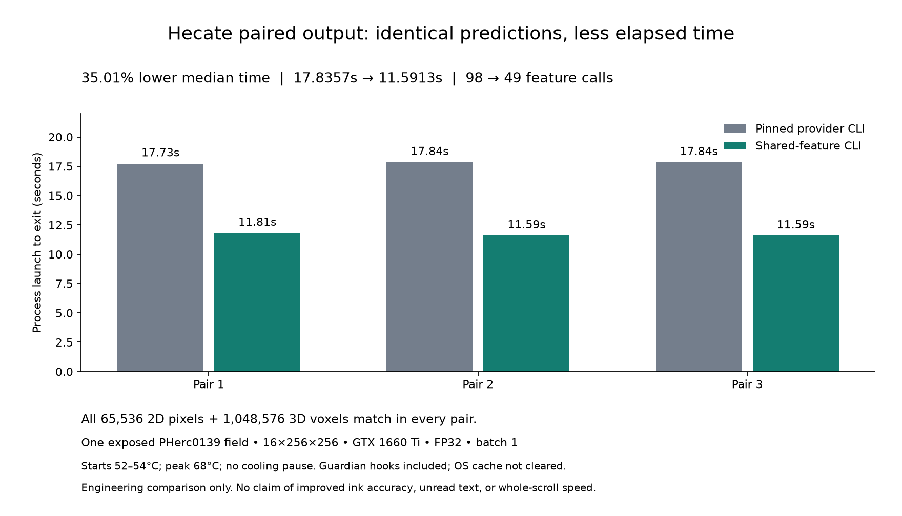

# September 2026: ARGUS and measured pipeline improvements

Team Cinder Covenant — Ryan Gurganious and Daine Ball.

## Review the contributions

- **ARGUS:** [evidence package](evidence/README.md), [downloadable ZIP](ARGUS_SEPTEMBER_2026_EVIDENCE.zip), [public control instructions](../PUBLIC_RUN.md). The current source includes the runtime-isolation correction and its three fixtures in the portable CI runner.
- **Villa input checks:** [PR #1897](https://github.com/ScrollPrize/villa/pull/1897), [recorded real-data failure](evidence/evidence/INFERENCE_FAILURE.json).
- **Villa renderer:** [PR #1901](https://github.com/ScrollPrize/villa/pull/1901), [tested metadata correction and unchanged pixels](evidence/evidence/RENDERER_CORRECTION.json). The artifact names the tested candidate; consult the PR for its current publication/review status.
- **Hecate:** [upstream PR #1](https://huggingface.co/scrollprize/hecate/discussions/1), [proposal and reproduction](hecate/PUBLIC_REVIEW_DRAFT.md), [numeric measurement](hecate/PUBLIC_MEASURED_RESULT_20260930.json), [source/test package](hecate/HECATE_SEPTEMBER_2026_CONTRIBUTION.zip). The PR is open for review; publication is not upstream acceptance.
- **Public Hecate control route:** [guarded Workbench runbook](HECATE_CONTROL_ROUTE_20260930.md), [preparation script](../../scripts/prepare_hecate_pherc0139_control.py), [bounded source-pixel verifier](../../scripts/verify_hecate_control_source.py), and [strict-load-only runtime verifier](../../scripts/verify_hecate_strict_load.py). The retained PHerc0139 exposed-control preparation and source correspondence are documented in [sanitized receipts](hecate/PHERC0139_CONTROL_PREPARATION_20261001.json) and [source receipt](hecate/PHERC0139_SOURCE_CORRESPONDENCE_20261001.json); the [strict-load receipt](hecate/HECATE_STRICT_LOAD_20261001.json) confirms the model loads without inference. This is an exposed control, not an unread-scroll reading.
- **Supporting controls:** [larger known-title mask preservation, real label-refinement invocation and measured hardware](SUPPORTING_CONTROLS_20260930.md), including the [512-square actual-CLI result and thermal limits](hecate/ACTUAL_CLI_512_RESULT_20260930.json).
- **Evaluation geometry diagnostic:** [PHerc0139 w016 frozen mask-distance and spatial-null analysis](geometry/README.md). The known-domain model association is not explained solely by the tested mask-distance score, but other spatial confounds and transfer remain unresolved.
- **Retained research supplement:** [corrected archival transfer and topology summary](RETAINED_RESEARCH_LIMITATIONS_20260930.md).
- **Research collection:** [metadata-only portfolio summary](RESEARCH_COLLECTION_20260930.md) describes retained multi-scroll CT-field selections, four local representation baselines, derived geometry/profile resources and private-versus-public availability. It includes no raw CT chunks or model weights. It records the checkpoint-family transfer-gate results and material scoring, preparation, source-binding and cohort limits. It is not a tie-correct rescoring, a causal generalization result or a public full-prediction replay.
- Supporting Villa work: [ARGUS listing #1896](https://github.com/ScrollPrize/villa/pull/1896), [fiber-parser assertion/documentation #1902](https://github.com/ScrollPrize/villa/pull/1902), both merged. ARGUS [exposure-accounting PR #1](https://github.com/Cinder-Covenant/ARGUS/pull/1) is part of the ARGUS contribution.

## Measured outcomes

The PHerc0139 w016 workflow independently reproduces AUC **0.772238** and AP **0.578875** on **90,367** validation pixels. This is a known-domain control, not improved detector accuracy or cross-scroll qualification.

The renderer's disabled-pyramid correction preserves **12,288/12,288** retained Paris4 pixels while removing nonexistent levels from metadata. Three C++ targets and nine renderer tests passed on the identified local candidate.

Hecate's shared-feature candidate matches all **65,536 2D pixels and 1,048,576 3D voxels** in each of three actual-CLI baseline/candidate pairs. Median process time changes from **17.8357 to 11.5913 seconds (35.01% lower)** on one 16x256x256 exposed PHerc0139 field, FP32, batch one, two CPU threads and GTX 1660 Ti. No cooling pause occurred. This is a bounded paired-output engineering result, not a 2D-only, whole-scroll or accuracy claim.

## Evidence status and attribution

The original September source/evidence release was published at commit `18cbbd3e079cf6cfb6278c8c9afdc7a5b773d37a`, with [all four portable CI jobs passing](https://github.com/Cinder-Covenant/ARGUS/actions/runs/36774438341). Later supplements are identified by their own Git revision and checks. Villa #1897 and #1901 remain open submissions; merged status applies to #1896 and #1902. Hecate PR #1 remains open and contains `24a28567c71ef9dd954a3367779c5f8a3481ad78`. See the [publication receipt](PUBLICATION_STATUS_20260930.md), [combined contribution description](COMBINED_FORM_RESPONSE.txt), and [contribution URLs](CONTRIBUTION_URLS.txt). This documentation does not record a submitted prize form.

The sealed evidence folder is an immutable **prepublication snapshot**, so its files truthfully say they were local when assembled. This index is the publication wrapper. Original receipts and historical release manifests are preserved; no CT arrays, label arrays, checkpoints or unread-target images are included. The current release-manifest successor links the previous manifest, archived in `release_history/`.

The Hecate archive includes its upstream MIT license. Its nine-file source manifest remains unchanged; the license is an additional archive entry. Hecate, Villa, ink_9um and the Vesuvius data belong to their respective authors. We credit their work explicitly. LLM tools assisted implementation, analysis and packaging under operator direction.

**No confirmed unread-scroll reading or prize outcome is claimed.** A finite output does not establish a true negative for ink. The public control route begins with an existing surface volume; the private research driver and a fully autonomous whole-scroll reader are not published capabilities.
