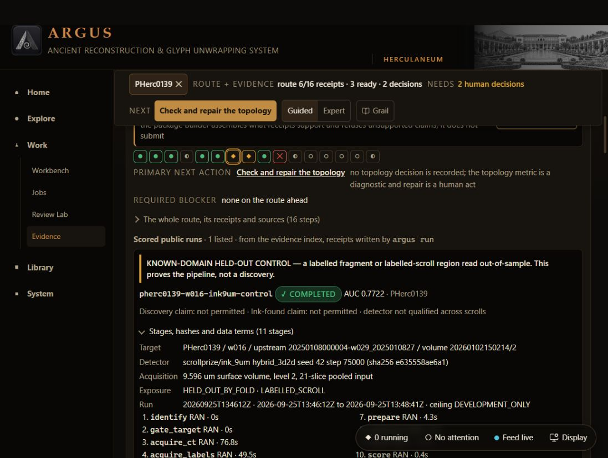
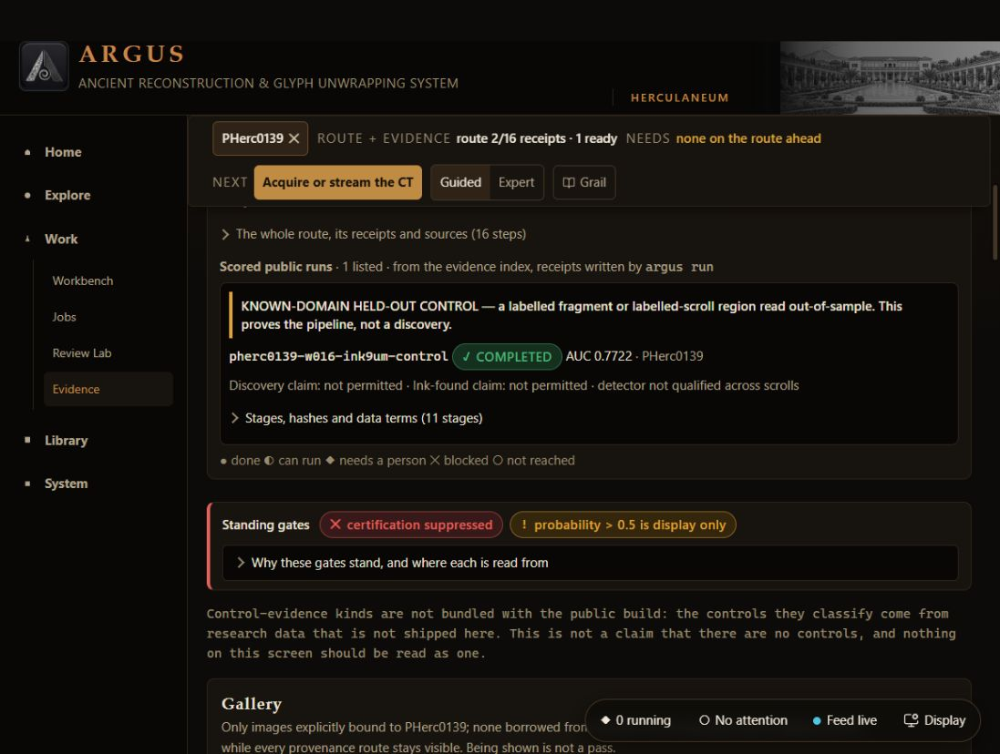

# ARGUS — September 2026 contribution evidence

Prepared 2026-09-30T20:26:11.262380+00:00. **Local delivery candidate; not uploaded or submitted.**

## Contribution

ARGUS connects existing Vesuvius tools into a reproducible control workflow and helps expose processing failures. The public route starts from an existing surface volume: it does not trace a whole scroll from raw CT. This package adds reviewable evidence to the existing public source and four September Villa PRs.

| Contribution | September evidence | Release state at packaging |
|---|---|---|
| ARGUS control workflow | PHerc0139 w016: 11 stages completed; AUC 0.772238, AP 0.578875 on 90,367 validation pixels | Public source and instructions; numeric evidence here |
| Villa #1897 | PHerc1667 numerical failure made explicit; checkpoint-form warning/strict option | Open; hosted Python checks pass |
| Villa #1901 | Effective geometry/settings recorded; Paris4 repeatability | Open public PR conflicts with upstream; reconciled local candidate is supplied |
| Renderer pyramid correction | Before: nonexistent levels 1–5 listed. After: level 0 only, 12,288/12,288 pixels unchanged | Included in tested local #1901 candidate |
| Runtime isolation | Before: six completed route steps borrowed from another process. After: two local setup steps and acquisition next | Local patch and three retained fixtures supplied |
| ARGUS exposure accounting | Physical identity and source-qualified ancestry; included public ARGUS PR #1 | Public, merged September 25 |
| Villa #1896 / #1902 | ARGUS listing / fiber-parser assertion and documentation | Both merged; supporting contributions |

**Scientific finding:** no confirmed unread-scroll text. PHerc0139 is a known-domain control; the existing detector is credited to its authors. None of these measurements establishes detector superiority, true negative ink, a whole-scroll pipeline, or a prize outcome.

## Inspect in five minutes

1. Read [public contribution URLs](CONTRIBUTION_URLS.txt) and [current PR status](evidence/PUBLIC_STATUS.json).
2. Inspect the [scoring evidence](evidence/PHERC0139_CONTROL_SCORE.json) and [actual inference failure](evidence/INFERENCE_FAILURE.json).
3. Inspect the [renderer correction](evidence/RENDERER_CORRECTION.json), [C++ results](evidence/renderer_cpp_tests.txt) and [CLI results](evidence/renderer_cli_tests.txt).
4. Compare the runtime captures below. These inspect a retained run; they do not show new inference.
5. Follow [reproduction instructions](REPRODUCE.md). [MANIFEST.json](MANIFEST.json) binds each packaged file. Original receipts remain preserved locally; exported measurements carry their source hashes.

### Runtime isolation — before

### Runtime isolation — corrected

## Form choices

- [Public-now answer](FORM_RESPONSE_PUBLIC_NOW.txt): existing released code and PRs, with local evidence accurately identified.
- [Answer with this evidence package](FORM_RESPONSE_WITH_PACKAGE.txt): includes the two local tested follow-up corrections. Use when judges have an accessible copy of this package; add the actual package link. It does not claim the candidate is merged.
- [Team field](TEAM_FIELD.txt).

## Attribution and scope

ARGUS by Ryan Gurganious and Daine Ball, Team Cinder Covenant. Vesuvius Challenge supplies the CT/labels; Villa and the released ink_9um authors supply the underlying preparation/inference. Credit Villa #1890 for its separate precision control, #1831 for physical units, #1905 for band prefetch and #1804 for reader-side handling of existing malformed stores. ARGUS source is Apache-2.0; Villa patches remain under Villa's MIT terms. Dataset terms are [Vesuvius Challenge open data](https://scrollprize.org/data), CC BY-NC 4.0. This package contains numeric reports and interface captures, no CT arrays, labels, weights or target images.

The previously generated 180-second walkthrough remains available locally, but contains third-party reference imagery and a LOCAL REVIEW ONLY title card. It is not included in this public distribution candidate; its original approval/attribution review remains outstanding. The two ARGUS interface captures above provide the retained before/after demonstration here.

Hecate's paired-output optimization is a separate contribution with its own package. Work already rewarded in August and private integration PR counts are excluded from the September claim.
